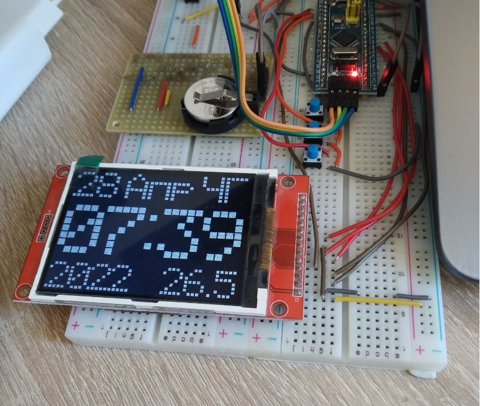
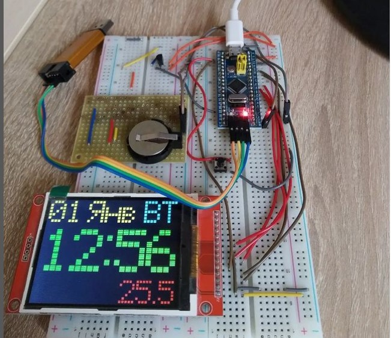

# Animation clock on STM32 + ILI9341

This is my version of animation clock from article https://radiokot.ru/articles/67/
and author GFX from topic https://www.radiokot.ru/forum/viewtopic.php?t=152886
project based on SPL library

Parts
- STM32F103C8 BluePill
- ILI9341 without touch screen sensor
- DS18B20

Сircuit diagram drawn via Dip Trace CAD and located in **hardware** folder

Whats done:
- Added year adjustment 
- Speed up buttons response 
- Added Black and White theme
- Code refactoring 

For display theme setup you should find a row:

```#define BLACK_AND_WHITE 0```

If it's equal 0 you will have colored theme else if 1 black and white theme

TODO:
- Humidity measurements
- PWM for screen backlight
- And USART data exchange for desktop application https://github.com/Ledrunning/TinnyMonitor

Device view:  

## Black & White



## Colored



[Article in Russian: ](https://ledrunning.wordpress.com/2023/07/23/animationclock-stm32-tft/)
